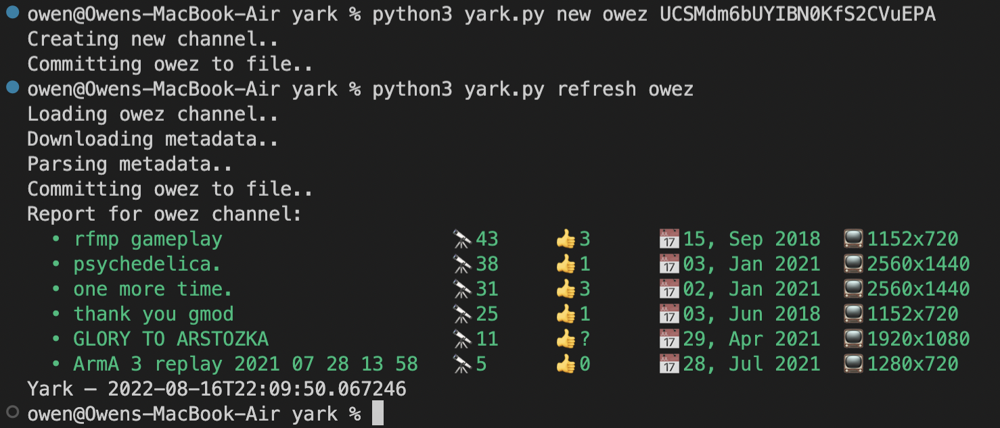

# yark

YouTube archiving made simple

## Installation

To install yark, simply download it off of PyPI:

```shell
$ pip3 install yark
```

## Usage

Once you've installed yark, think of a name for your archive and copy the targets channel id:

```shell
$ yark new owez UCSMdm6bUYIBN0KfS2CVuEPA
```

Now that you've created the archive, you can tell yark to download all videos and metadata:

```shell
$ yark refresh owez
```

Right now scheduling isn't a feature so to run the archiver every now and then please use [`cron`](https://en.wikipedia.org/wiki/Cron) or something similar. Once a day is recommended because getting metadata takes ages!

## Demo

Here's my sparse YouTube channel being newly archived by yark:



If there was anything being updated/deleted on further refreshes, the report list would be colourcoded either blue or red to indicate what happened!

Also, check the `examples/` directory for how to use yark in scripts if needed. This feature is new and yark is really intended to be used via the command-line so you might find a few issues.
